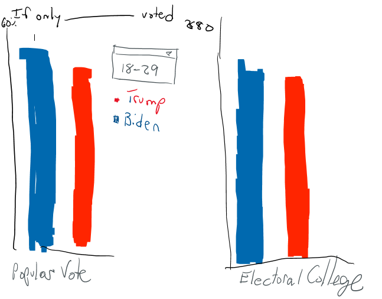

| [Home](https://ncbartel.github.io/Portfolio/) | [Visualizing Debt](visualizing-government-debt) | [Critique by Design](critique-by-design) | [Final Project I](final-project-part-one) | [Final Project II](final-project-part-two) | [Final Project III](final-project-part-three) |

# Critique by Design with Tableau

## Overview of Original Visualization 
The <a href = "https://data.world/makeovermonday/2021w27" target="_blank">If Only ____ Voted</a> visualization outlined how depending on the demographic group the 2020 US Presidential Election using data would have resulted between Donald Trump and Joe Biden. The visualization made by Dustin Gibson on Reddit originating from the AP News Exit polling has individual electoral maps per demographic group. 

## Data Visualization Effectiveness Profile of Original Visualization

Based on the <a href ="http://www.perceptualedge.com/articles/visual_business_intelligence/data_visualization_effectiveness_profile.pdf" target ="_blank">Data Visualization Profile</a> by Stephen Few, this visualization was evaluated on usefullness, completeness, perceptibility, truthfulness, intuitiveness, aesthetics, and engagement. 

**Usefulness**
*4/10*

I believe that this visualization earned a 4 as while it was perceptable, it was very long image that was hard to view on the website. This would make it harder for the intended audience to pull the information they wanted out of the visualization. Additionally, through using a U.S. map, it was hard to evaluate the popular vote that each candidate won by in each state. 

 This was posted under r/dataisbeautiful Reddit thread which means that this was designed for Reddit users who are politically interested with U.S. politics. With a release date 3 years ago, this was likely following the January 6th Insurrection attacks where the question of who voted for President Biden versus former President Trump was on the minds of people interested in this election. The diagram matching the intended audience and the format being relevant to the topic is what earned this visualization a 4. 

**Completeness** 

*7/10*

I rated this a 7 out of 10 because while the visualization does have all of the demographics within the dataset from AP News, it is missing the popular vote percentages which leads to an incomplete visualization of the data. It is important to include the popular vote as electoral votes are not representative of the total population as some states such as New Hampshire or Montana have a lower population to electoral college representative ratio compared to states such as California. However, it does include electoral victories and the summation of each candidate at the top, so this was a positive aspect increasing its score. So while most of the data is there, this visualization receives a 7.  

**Perceptibility** 

*4/10*

I rated this a 4 out of 10 as the image at first glance is very long and that leads it to be presented as very narrow and impossible to read without having to zoom into the iamge which prevents viewing the entirety of the visualization. It also uses a map-based approach which does not adequately reflect the concentrations of voters making it seem like one party is in more control color wise than it actually does population or even electoral college wise. It did recieve some points as it included the horizontal stacked bar chart visualization showing the totals for both Trump and Biden. However, overall, this visualization was challenging to read. 

**Truthfulness**

*10/10*

This visualization gets a 10 out of 10 as the data originates from AP News, a broadly accepted non-partisan news source. The data itself represents the data accurately in a commonly understood manner. The only minor critique on this was that the land area of the United States can be mistaken on the scale as representative of the population.

**Intuitiveness** 

*7/10*

This visualization gets a 7 out of 10 as the data does convey the message moderately well. However, I knocked 3 points off as it is challenging to view the different demographics easily without zooming in on the image itself which then requires scrolling. The map gives a clear, intuitive representation that the data is explaining voting information about the United States which is the main objective of using this display format. 

**Aesthetics**

*4/10*

I rated this a 4 out of 10 as while the images make sense, there are no elements of interest intially that pop out at me. It is hard to read, takes an unnecessary amount of time to analyze, and is generally not visually appealing.

**Engagement**

*1/10*

On the initial post itself, it does not give any sort of information regarding where they got the information or how the audience can get more involved with voting or the like. With it being on Reddit, it does offer a platform for people to comment on it. Yet, without any access to the raw data, it is increasingly challenging for the audience to engage further with the data. 

**Initial Observations**

As mentioned previously, my initial observation was that there was simply too much activity going on with every single map being visible in one location. I did find the concept of showing how different groups would have voted if they were the only groups voting interesting. However, the land-based electoral maps play into the conflation between land size and population density. This is something that has played into the "stolen election" ideas from 2020 of "look at all of these red states" instead of looking at the populations of said states or number of electoral college votes that a state has. I would recommend instead to remove the map instead and look at the popular vote versus the electoral vote to promote the idea of land does not vote. 

**Intended Audience** 

I believe that the intended audience is anyone who is interested in American politics and is a Reddit user who is interested in data visualizations as it is posted on a thread for that topic on that platform.

## Wireframe

In my wireframe redesign, I decided to remove the map entirely to remove possible geographic land bias. I then wanted to turn the horizontal stacked bar chart into a vertical bar chart to allow for there to be easier distinguishing features for the viewer to quickly look at the design and know the results. Another component that I wanted to add was a dropdown menu instead of a unique map for every single demographic group as it would save on space and time for the viewer to process the information. I decided to stick with the red and blue colors for the Republicans and Democrats, respectively, given the party colors. However, since there were third parties also involved, I chose to add in independent voters by subtracting between Joe Biden and Donald Trump's percent votes. This helps to counteract another critique of the original design promoting only a binary party country by not acknowledging that there are other minor parties instead. The last major component that I changed was that I also added popular vote results versus electoral college results to show how just because a candidate might have won the state via the winner take all method like 48 states employ, it is not representative of the United States as being just red or blue but a shade of purple.      

## Testing the Solution

In evaluating this wireframe, I asked 3 people adult, late 70s; adult, late teens; and adult, mid 50s for feedback on my design.

**Adult, Late Teens**

**Adult, Early 50s**

**Adult, Late 70s**

## Final Product

<noscript></noscript><object class='tableauViz'  style='display:none;'><param name='host_url' value='https%3A%2F%2Fpublic.tableau.com%2F' /> <param name='embed_code_version' value='3' /> 
<param name='site_root' value='' />
<param name='name' value='DataCritique&#47;Dashboard1' />
<param name='tabs' value='no' />
<param name='toolbar' value='yes' /><param name='static_image' value='https:&#47;&#47;public.tableau.com&#47;static&#47;images&#47;Da&#47;DataCritique&#47;Dashboard1&#47;1.png' /> 
<param name='animate_transition' value='yes' />
<param name='display_static_image' value='yes' /><param name='display_spinner' value='yes' />
<param name='display_overlay' value='yes' />
<param name='display_count' value='yes' />
<param name='language' value='en-US' /></object>
                

