| [Home](https://ncbartel.github.io/Portfolio/) | [Visualizing Debt](visualizing-government-debt) | [Critique by Design](critique-by-design) | [Final Project I](final-project-part-one) | [Final Project II](final-project-part-two) | [Final Project III](final-project-part-three) |

# Outline

One of the greatest threats to American Democracy is polarization. Americans are seeing each other as hating everything the other one is with the "If you are not with me, then you are my enemy" mindset. However, the data suggests that this simply is not true. There are a lot of common issues that Americans agree on, but political messaging makes it seem like we do not. 

A controversial political topic is climate change. It has faced corporate influence from trying to prevent policy changes to trying to take advantage of green policies and has also dealt with politicalization of science. With this project, I want to wipe away the polarization and past narratives of the "tree hugging left" and the "drill baby drill right" to see how Americans actually want to see change. 

In Spring 2023, I conducted nationwide survey of 1,300 Americans from across the country looking people's perspectives on climate change, their self-assessed level of knowledge in energy policy, and where they think our energy comes from and how they would envision it changing in their ideal world. While conducting this survey and using this data for a senior capstone project, I want to take a previously academic approach in the story this data was telling and tell a more personal story of how Americans across the US feel when it comes to American energy using tools from Telling Stories with Data class. 

There are three main stories I want to tell with my data:
1. Our ideas about where our energy comes differs from where it actually does
2. Americans want more renewable energy across the board 
3. The impact of views on climate change impacting different desired energy portfolios

## Initial sketches

### Setup

#### Current Economic Impacts
Based upon past poll data, economic impact is one of the leading influencing factors on belief in climate change and action towards it. So I want to start off sharing how the economic impacts of climate change are a now issue. Instead of telling big data points of $X amount was lost to climate change, as seen in class, we have a hard time visualizing trillions, billions, and millions. So, I want to talk about individual impacts on cities and towns across the United States and how they were economically impacted. I want to have people to scroll through each site selected to read about what happened in each location.

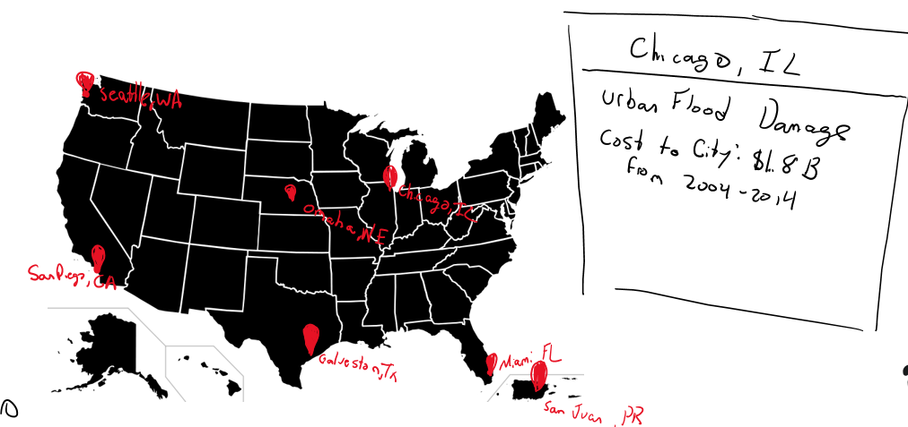

#### Current Climate Impact of Energy 

Another core part of understanding the context of why energy sourcing is important is through the carbon impact of the electricity that we use. Through use of a pie graph, viewers will be able to see the relationship between the main different types. 

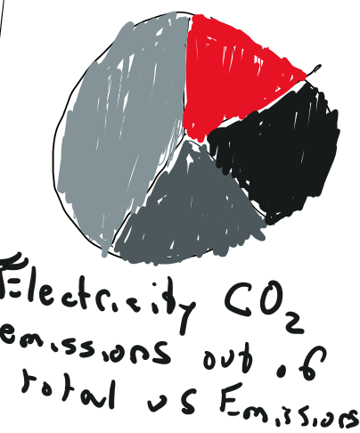

#### How the US Energy Portfolio has Changed?

I want to also then go into while the current state of energy production has been mainly natural gas, these have been the historical trends. If possible, I would like to make it have a slider that the user can scroll along and see how it changes over time. time. 

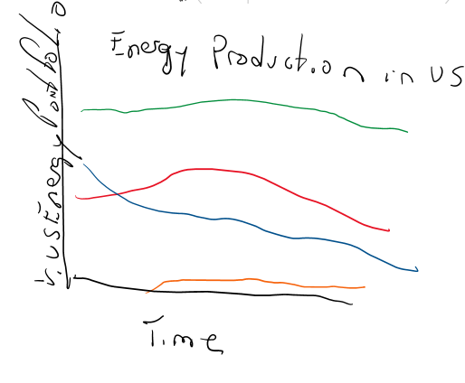

### Conflict

#### American politicans are making it seem as if renewable energy is the most dividing thing

Another core aspect of this story is the impact of the current political climate on the energy portfolio. I want to show the current political climate and how major names in politics are currently talking about energy policy. I envision a picture of the politician, a quote from them, and their position and name and 3 of them to follow the rule of 3s. 

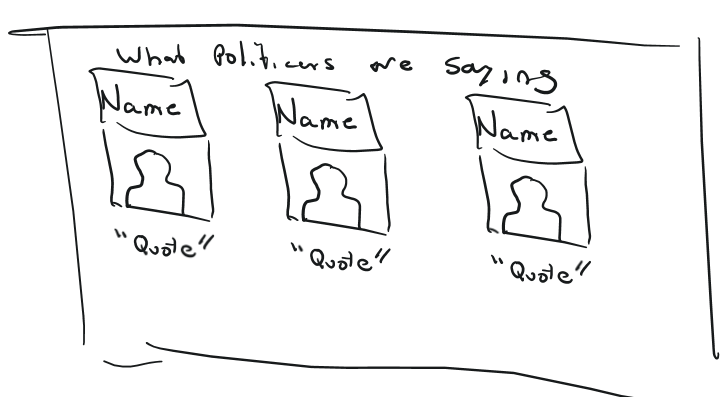

#### Americans are feeding into the rhetoric 

For this, I want two graphics. One talking about young adults who believe that violent protest against the U.S. government is okay and then show it among older adults. I want to use a black background and a red font to push the danger messaging that this is not okay.

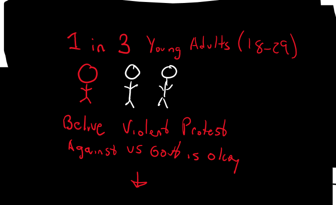

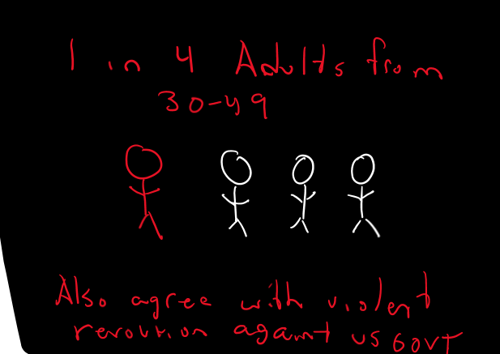

#### Americans are feeling worried about each other

Another core element is trust and distrust of institutions and each other. If people are unable to trust each other that they want the same thing on a values basis, then they are not going to work together for issues that require an equal moral ground to build into policy or political views. So, I want to show that Americans are trusting each other and institutions less now than before and that we know that it is an issue facing the US. This does increase my happiness rating a bit since it shows that we are aware it is an issue which might lead to action down the line. 

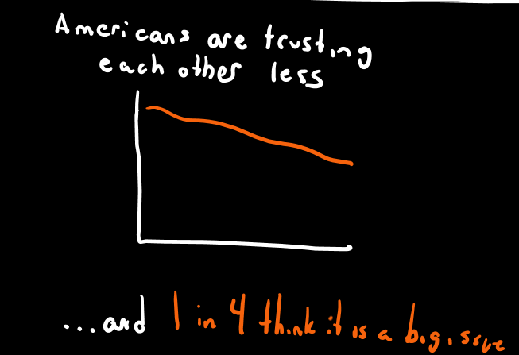

#### The "It's Not Me, It's You" Issue

I then want to share that Americans believe that polarization is the main reason people are less trusting of institutions. This then reflects on the main idea of climate policy as if people cannot trust the institutions that are putting forth these policies, then these policies are less likely to be enacted. I want to use orange as another alert color with text on the screen instead of a visualization to balance the text to image to visualizations in the story. 

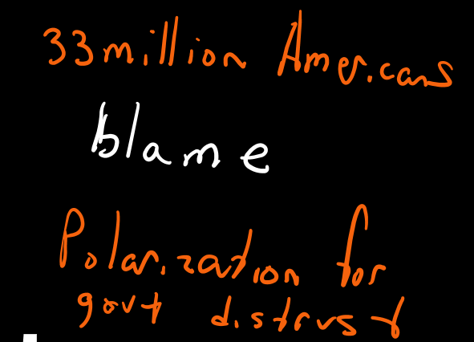

## Resolution

#### Green energy crosses party and ideology

I then want to use the data from the study I led which compared Yale's Program on Climate Change Communication's Six America's Profiles against people's desired energy portfolio changes in the U.S. energy market. Based upon our data from the study, we showed that it transends political party, ideology, or climate belief and varies at the level of change that each group wants. 

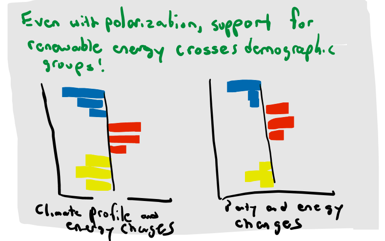

#### We have political and tech liftoff! 

I want to then show tangible examples of major renewable energy successes whether it be implementation such as in Babcock Ranch, Florida or innovations. Then, I also want to show how policymakers are also working to make changes to help promote renewable energy with policies found in the CHIPS and Science Act or other regulations. This also helps mitigate against the "we care, but politicans don't and there is no hope for new innovation" and provides some cautious optimism. 

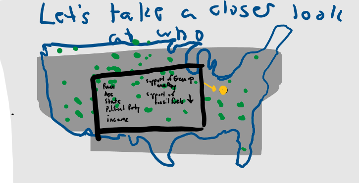

#### Taking it to the streets

Since that previous data was very mile high on its analysis, I then want to find people who fall within the averages of the total and in each of the compared political and climate profile groups then use that information profiles from across the country to show actual respondents and their demographics. My intended approach is to connect the big data of the sample with the individual level as well. This also shows that it is more than just tends but there are actual people that think this way. 

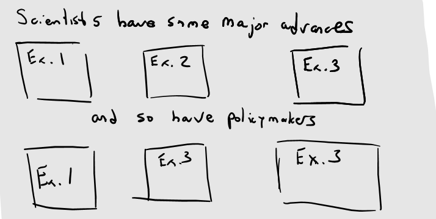

#### Together we can **SAVE** the country!

For my call to action, I want to use the acronym S.A.V.E (Share thoughts on climate change, Analyze for factual reports on the issue, Vote for Eco-Friendly Politicans, and Explore new energy policy advances). Acronyms can be used as effective ways to display information and keep it on the mind of its viewer as an easy to remember method. 

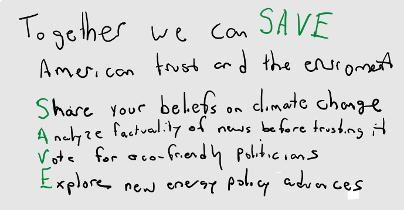

# The data

| Name | URL | Description |
|------|-----|-------------|
|The COVID States Project|[www.covidstates.org](https://www.covidstates.org/reports/americans-views-on-violence-against-the-government)| I plan to use this to show the violent protest and distrust in America data. |
|Pew Research Center|[www.pewresearch.org](https://www.pewresearch.org/politics/dataset/american-trends-panel-wave-40/)|I plan to use this data to show the lack of trust between Americans and impact of polarization. |
|Center for Energy Policy & Management|[Personally Owned CSV Raw Data](2023energyprofilesinamerica.csv)|I plan to use this to show how each energy source is impacted by political and ideological influences. This data comes from a nationally representative (N=1300) study of Americans used in a Senior Capstone in Spring 2023. |

# Method and medium
> In a few sentences, you should document how you plan on completing your final project. 

Text here...
